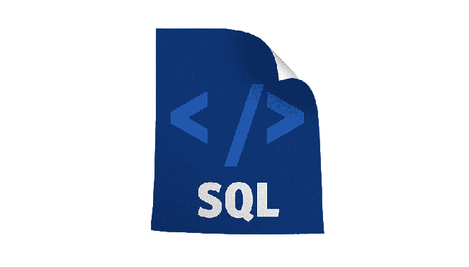

# Projeto consulta BD STEAM (em construção)

Projeto de conclusão de módulo do curso de Desenvolvedor Web Full-Stack da Resilia Educação.

# Objetivos

- [x] Consolidar os conhecimentos adquiridos durante o módulo;

- [x] Comprovar a nossa capacidade de modelar um banco de dados relacional usando o MySQL;

- [x] Responder perguntas diversas através de consultas ao banco de dados usando SQL como linguagem;

- [x] Criar um dashboard que mostre os resultados das consultas;

- [x] Organizar o trabalho de forma assertiva usando a ferramenta de gestão de projetos ágeis SCRUM;

- [x] Fazer uso dos conhecimentos adquiridos através das aulas de SOFT SKILLS como inteligência emocional, trabalho em equipe, resolução de problemas, gestão de tempo e adaptabilidade.

# Tecnologias utilizadas

   
   
   

# Criação do Banco de Dados

