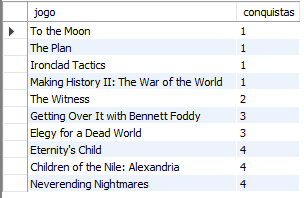

# Projeto consulta BD STEAM (em construção)

Projeto de conclusão de módulo do curso de Desenvolvedor Web Full-Stack da Resilia Educação.

# Objetivos

- [x] Consolidar os conhecimentos adquiridos durante o módulo;

- [x] Comprovar a nossa capacidade de modelar um banco de dados relacional usando o MySQL;

- [x] Responder perguntas diversas através de consultas ao banco de dados usando SQL como linguagem;

- [x] Criar um dashboard que mostre os resultados das consultas;

- [x] Organizar o trabalho de forma assertiva usando a ferramenta de gestão de projetos ágeis SCRUM;

- [x] Fazer uso dos conhecimentos adquiridos através das aulas de SOFT SKILLS como inteligência emocional, trabalho em equipe, resolução de problemas, gestão de tempo e adaptabilidade.

# Tecnologias utilizadas

<div style="display: inline_block">
   
   
   
</div>

# Comandos para criação do banco de dados Steam

_Criação do banco_

```
CREATE DATABASE `bdsteam`;
```

_Criação da tabela steam_dados_

```
CREATE TABLE `steam_dados` (
   id INT PRIMARY KEY NOT NULL,
   nome TEXT,
   data_lancamento DATE,
   desenvolvedor VARCHAR(100),
   plataformas VARCHAR(100),
   faixa_etaria INT,
   genero VARCHAR(50),
   conquistas INT,
   avaliacoes_positivas BIGINT,
   avaliacoes_negativas BIGINT,
   tempo_medio_de_jogo BIGINT,
   proprietarios VARCHAR(100),
   preco DOUBLE
);
```

_Criação da tabela steam_media_

```
CREATE TABLE `steam_media` (
   id INT PRIMARY KEY NOT NULL AUTO_INCREMENT,
   id_steam_dados INT,
   filmes VARCHAR(1000),

FOREIGN KEY (id_steam_dados) REFERENCES steam_dados(id)
);
```

_Criação da tabela steam_suporte_

```
CREATE TABLE `steam_suporte` (
   id INT PRIMARY KEY NOT NULL AUTO_INCREMENT,
   id_steam_dados INT,
   suporte_website VARCHAR(300),
   suporte_url VARCHAR(300),
   suporte_email VARCHAR(300)
);

ALTER TABLE steam_suporte ADD FOREIGN KEY(id_steam_dados) REFERENCES steam_dados(id);
```

_Fonte de dados utilizado nas tabelas_

```
steam_dados: "./fonte_de_dados/steam.csv"
steam_media: "./fonte_de_dados/steam_media_data.csv"
steam_suporte: "./fonte_de_dados/steam_support_info.csv"
```

# Imagens do banco de dados

**Tabela steam_dados**

SELECT \* FROM `steam_dados`;


**Tabela steam_media**

SELECT \* FROM `steam_media` ORDER BY `filmes` DESC;


**Tabela steam_suporte**

SELECT \* FROM `steam_suporte` ORDER BY `suporte_website` DESC;


**Tabela com os cinco maiores desenvolvedores da Steam**

SELECT `desenvolvedor`, COUNT(`desenvolvedor`) AS `qtde_jogos_desenvolvidos` FROM `steam_dados` GROUP BY `desenvolvedor` ORDER BY `qtde_jogos_desenvolvidos` DESC LIMIT 5;


**Tabela com a quantidade de jogos desenvolvidos por plataforma**

SELECT `plataformas`, COUNT(`plataformas`) AS `qtde_jogos_para_plataforma` FROM `steam_dados` GROUP BY `plataformas`;


**Tabela com os jogos mais jogados por gênero**

SELECT `nome` AS `jogo`, `genero`, `tempo_medio_de_jogo` FROM `steam_dados` ORDER BY `tempo_medio_de_jogo` DESC LIMIT 15;


**Tabela com os jogos menos jogados por gênero**

SELECT `nome` AS `jogo`, `genero`, `tempo_medio_de_jogo` FROM `steam_dados` WHERE `tempo_medio_de_jogo` > 0 ORDER BY `tempo_medio_de_jogo` LIMIT 30;


**Tabela com os jogos mais baixados**

SELECT `nome` AS `jogo`, `genero`, `proprietarios` FROM `steam_dados` ORDER BY `proprietarios` DESC;


**Tabela com os jogos menor adesão**

SELECT `nome` AS `jogo`, `genero`, `proprietarios` FROM `steam_dados` HAVING (`proprietarios` <= 100000) ORDER BY `proprietarios`;


**Tabela com os jogos com mais conquistas**

SELECT `nome` AS `jogo`, `conquistas` FROM `steam_dados` ORDER BY `conquistas` DESC LIMIT 10;


**Tabela com os jogos com menos conquistas**

SELECT `nome` AS `jogo`, `conquistas` FROM `steam_dados` where `conquistas` > 0
ORDER BY `conquistas` LIMIT 10;



**Tabela com os jogos por faixa etária**

SELECT `faixa_etaria`, COUNT(`faixa_etaria`) FROM `steam_dados` WHERE `faixa_etaria` > 0
GROUP BY `faixa_etaria`;


# Dashboards criados

**Quais os maiores desenvolvedores de jogos da Steam?**


**Quais as plataformas que mais possuem jogos?**


**Quais os jogos mais jogados por gênero e os menos jogados?**


**Quais os jogos mais baixados e os jogos com menos adesão?**


**Quais os jogos com mais e menos conquistas?**


**Quantidade de jogos por faixa etária?**

